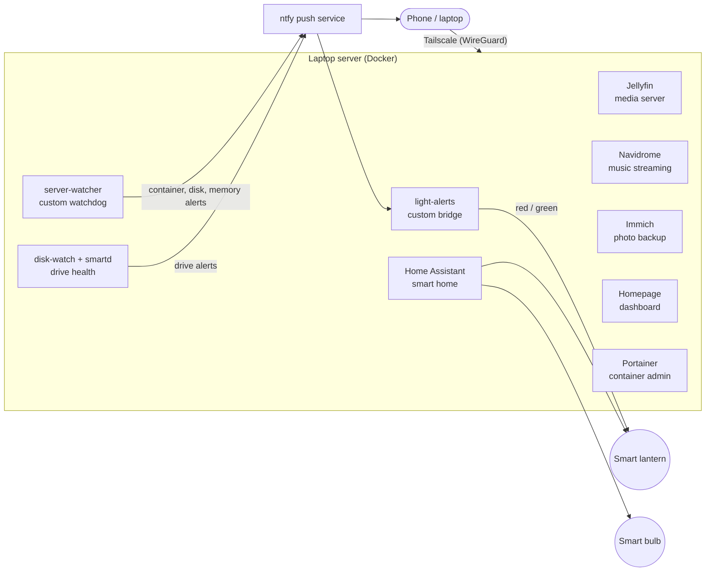

# Homelab

A self-hosted home server built on a repurposed laptop and run entirely with Docker Compose.
It hosts a photo library, a media server and a smart-home hub, and it **monitors itself**: custom
Python and shell tooling checks every container, the disk and the hard drive's health, and pushes
alerts to my phone and to a lamp on my desk that turns red when something is wrong.

This repository contains the configuration, the custom tooling and the write-ups behind it.

| | |
|---|---|
| **Hardware** | Repurposed laptop: Intel Core i5, 8 GB RAM, 1 TB hard drive |
| **OS** | Linux Mint |
| **Runtime** | Docker and Docker Compose |
| **Remote access** | Tailscale (WireGuard mesh), no ports forwarded on the router |
| **Alerts** | ntfy push notifications, plus a smart lamp as a physical status light |

---

## What this demonstrates

| Skill | Where to see it |
|---|---|
| **Linux administration** | cron jobs, `smartd` configuration, kernel-log and `/proc` based checks in [`disk-watch`](services/monitoring/disk-watch) |
| **Docker and Compose** | multi-container stacks, health checks, restart policies, bind mounts, named volumes and `.env`-based secrets across [`services/`](services) |
| **Monitoring and alerting design** | a custom watchdog that polls the Docker API and alerts only on state *changes* ([`server-watcher`](services/monitoring/server-watcher)); see [monitoring and alerting](docs/monitoring-and-alerting.md) |
| **Python and shell scripting** | [`watch.py`](services/monitoring/server-watcher/watch.py), [`alert_light.py`](services/smart-home/light-alerts/alert_light.py), [`disk-watch.sh`](services/monitoring/disk-watch/disk-watch.sh), the lantern control scripts |
| **Incident response and root-cause analysis** | [write-up of a real outage caused by a saturated hard drive](docs/incident-slow-disk.md) |
| **Networking and security** | Tailscale-only remote access, an external port scan to verify nothing is exposed, router review, secrets handling: [security notes](docs/security.md) |
| **IoT and API integration** | local-only control of smart lights over their UDP/LAN protocols, a template-light workaround for a colour bug: [`smart-home`](services/smart-home) |
| **Technical writing** | architecture, decisions, setup guide and troubleshooting in [`docs/`](docs) |

---

## Architecture



Details: [docs/architecture.md](docs/architecture.md)

---

## Services

| Service | Purpose | Folder |
|---|---|---|
| Jellyfin | Media server for my own library | [`media/jellyfin`](services/media/jellyfin) |
| Navidrome | Music streaming server | [`media/navidrome`](services/media/navidrome) |
| Immich | Self-hosted photo and video backup (4 containers) | [`media/immich`](services/media/immich) |
| Home Assistant | Smart-home hub, local control of a WiZ bulb and a Govee lantern | [`smart-home/home-assistant`](services/smart-home/home-assistant) |
| **light-alerts** *(custom)* | Turns the lantern into a server status light | [`smart-home/light-alerts`](services/smart-home/light-alerts) |
| **server-watcher** *(custom)* | Watchdog for containers, disk and memory | [`monitoring/server-watcher`](services/monitoring/server-watcher) |
| **disk-watch + smartd** *(custom)* | Early warning for a degrading hard drive | [`monitoring/disk-watch`](services/monitoring/disk-watch) |
| Homepage | Dashboard with live status per service | [`monitoring/homepage`](services/monitoring/homepage) |
| Portainer | Web UI for managing containers | [`admin/portainer`](services/admin/portainer) |

---

## Highlights

- **Self-monitoring with a physical indicator.** A watchdog posts alerts to ntfy; a second small service
  subscribes to the same stream and drives a lamp red or green. Only recoverable problems (a container
  down, disk full) affect the lamp; hardware warnings go to the phone only, because a failing drive never
  "recovers" and would leave the lamp red forever.
- **A real incident, written up.** When the laptop's slow hard drive saturated and several health checks
  failed at once, I traced it with `/proc/pressure/io`, per-process I/O sampling and SMART data, then added
  drive-level alerting. See the [incident write-up](docs/incident-slow-disk.md).
- **Local-first smart home.** Both lights are controlled over the local network with no cloud account.
  Where Home Assistant's built-in support fell short, I wrote small scripts against the device's LAN protocol.
- **Verified, not assumed, security.** I tested the server from outside the home network to confirm no
  service is reachable, and documented the remaining gaps honestly: [security notes](docs/security.md).

---

## Repository layout

```
homelab/
├── README.md
├── LICENSE
├── docs/
│   ├── architecture.md
│   ├── monitoring-and-alerting.md
│   ├── incident-slow-disk.md
│   ├── security.md
│   ├── decisions.md
│   ├── setup-guide.md
│   └── troubleshooting.md
└── services/
    ├── media/            jellyfin, navidrome, immich
    ├── smart-home/       home-assistant, light-alerts
    ├── monitoring/       server-watcher, disk-watch, homepage
    └── admin/            portainer
```

Each service folder has a short README, a `docker-compose.yml` and, where needed, a `.env.example`.

---

## Running it

This is a personal setup shared as documentation, not a one-click installer. To try a piece of it:

```bash
cd services/monitoring/server-watcher
cp .env.example .env       # then fill in your own values
docker compose up -d --build
```

The [setup guide](docs/setup-guide.md) covers the full order. Files contain bracketed notes such as
`(Put your own time zone here)` wherever a value must be replaced; search for `(Put` to find them all.
Addresses in the files are placeholders or private-range examples.

## Security and privacy

No credentials, keys, tokens or personal data are stored in this repository. Secrets live in `.env` files that
are git-ignored, and each folder ships an `.env.example` instead. See [docs/security.md](docs/security.md).

## Known limitations

Honest list of what is not done yet (also in the docs): no off-site backup, the dashboard has no login on the
local network, and the storage is a single slow hard drive that I monitor rather than replace.

## License

MIT, see [LICENSE](LICENSE).
