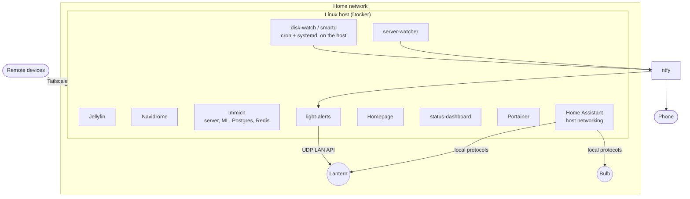

# Architecture

## Overview

One laptop runs everything as Docker containers. Each application is isolated in its own container(s),
described by a `docker-compose.yml`, restarts automatically (`restart: unless-stopped` / `always`) and
keeps its state in bind-mounted folders on the host.



## Layers

| Layer | Components | Notes |
|---|---|---|
| Applications | Jellyfin, Navidrome, Immich, Home Assistant | Each in its own Compose project |
| Admin and visibility | Portainer, Homepage, status-dashboard | Read the Docker socket to show state; the status dashboard also reads `/proc` and cgroups and serves a JSON API |
| Self-monitoring | server-watcher, disk-watch, smartd | Custom code; alerts go to ntfy |
| Physical signalling | light-alerts + smart lantern | Subscribes to the alert stream |
| Access | Tailscale | No router port forwarding |

## Conventions

- **Secrets** are never in Compose files. Compose uses `${VARIABLE}` references and each folder ships a
  `.env.example`; the real `.env` is git-ignored.
- **Paths** use `${HOME}` so the files are portable between users.
- **Time zone** is set per container with `TZ` so log timestamps and schedules are consistent.
- **Health checks** exist for the services that support them, and the watchdog treats `unhealthy` the same
  as `exited`.
- **Restart policies** make the stack come back after a reboot without manual steps.

## Data layout

```
~/server/media/{movies,tv,music,photos}   media libraries (read-only where possible)
~/docker/<app>/                           per-app config and databases
~/server/<app>/                           apps with their own compose project
```

Backing up the server means two things: the configuration in this repository (small and reproducible)
and the data folders (large; not in this repository).

## Networking

- Most containers publish a port on the host and are used from the LAN or over Tailscale.
- **Home Assistant** runs with `network_mode: host` because device discovery and the light protocols use
  broadcast/multicast UDP, which does not cross Docker's bridge.
- **Tailscale** provides remote access through a WireGuard tunnel. The server also advertises the home
  subnet so remote devices can reach LAN addresses; the trade-off is discussed in [security.md](security.md).
- Nothing is forwarded on the router; see [security.md](security.md) for how that was verified.
