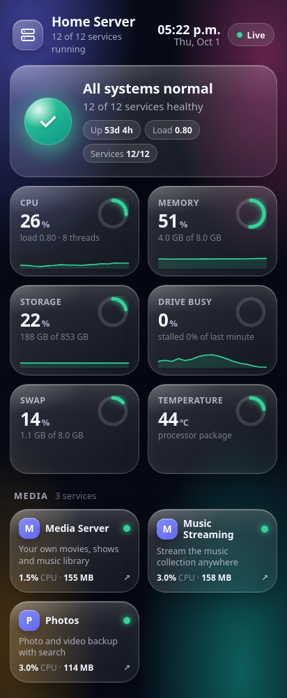
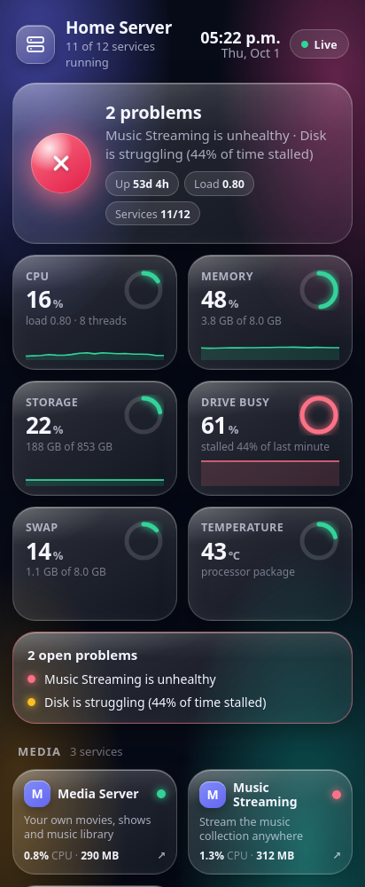
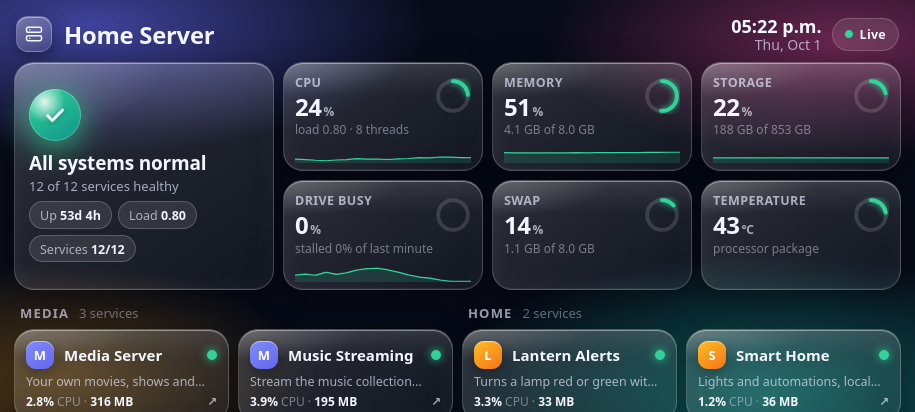

# status-dashboard (custom)

A real-time web dashboard and small JSON API for the whole server. Standard-library Python plus one static page;
no packages to install and nothing written to disk.

<p align="center">
  
  &nbsp;
  
</p>
<p align="center">
  
</p>

## What it shows
- An overall status (all good, needs attention, problem) with the reason.
- Six live gauges with history sparklines: CPU, memory, storage, drive stall, swap and temperature.
- Every container with its health, CPU and memory, grouped and linked to its web page.
- Open problems: an unhealthy or stopped container, disk or memory nearly full, or a drive that is stalling.

## Key points
- **Cheap to run:** about 25 MB of RAM and almost no CPU. Per-container numbers come from cgroup v2 files instead of
  the slow Docker stats API.
- **Hardened:** read-only container filesystem, all capabilities dropped, `no-new-privileges`, CPU and memory limits.
  It only mounts the Docker socket, `/sys` and the host root read-only.
- **Responsive:** one fluid layout with a compact short-and-wide mode for a phone in landscape, safe-area padding for
  notches, light and dark themes, and an installable web-app manifest.
- **Phone-friendly performance:** lighter blur on small screens, polling pauses while the tab is hidden.
- **No login:** it is read-only and shows no secrets, but keep it on your home network or behind Tailscale.

## API
| Endpoint | Returns |
|---|---|
| `/` | the dashboard page (first data is inlined, so it paints immediately) |
| `/api/status` | everything: host metrics, containers, problems |
| `/api/summary` | a few flat numbers, handy for other dashboards |
| `/api/service/<container>` | one container's state, health, CPU and memory |
| `/api/history` | recent samples for the sparklines |
| `/healthz` | liveness check |

## Run it
```bash
cp services.example.json services.json      # name your own containers
docker compose up -d --build                # then open http://<server>:3002
```
Set `SERVER_NAME` in `docker-compose.yml` (bracketed note) to change the title. `DEMO=1` serves synthetic data, and
`DEMO=1 DEMO_BAD=1` shows the problem state.

## Files
- `app.py` - collector, API and web server
- `static/` - the page, web-app manifest and icon
- `services.example.json` - friendly names and groups for containers
- `Dockerfile`, `docker-compose.yml`
